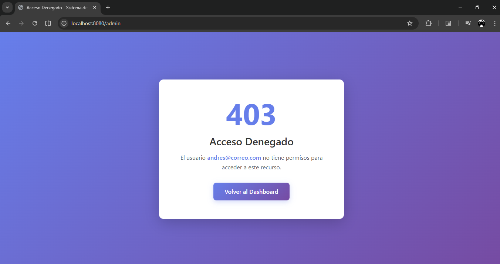
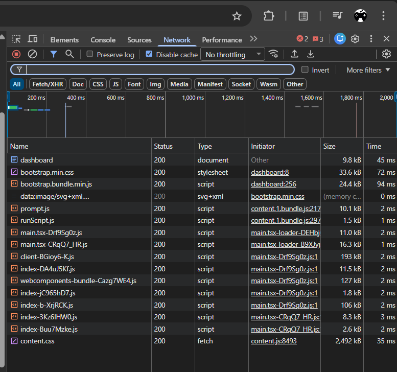
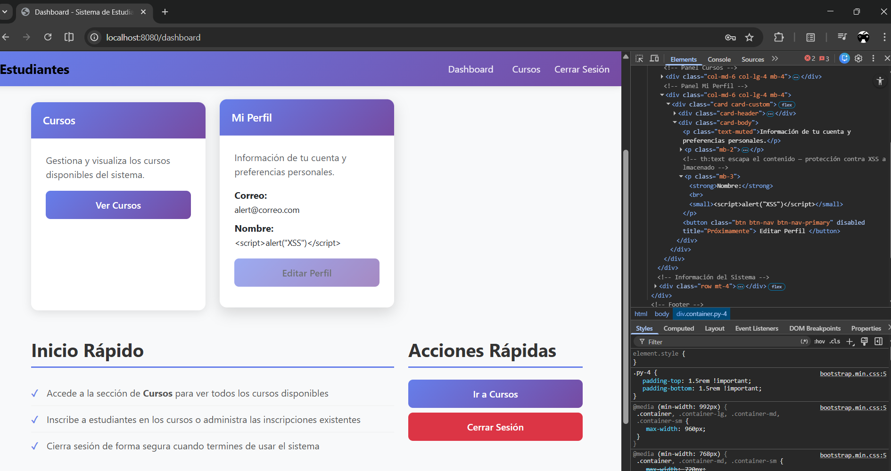

# post2-u8 — Gestión de Cursos y Estudiantes con Autenticación y Roles

Proyecto Spring Boot completo que implementa:
- ✅ Autenticación y autorización con Spring Security
- ✅ Relación bidireccional `@ManyToMany` entre `Curso` y `Estudiante`
- ✅ Sistema de roles (ADMIN y USER)
- ✅ Interface moderna con Bootstrap 5.3
- ✅ Gestión segura de usuarios con contraseñas encriptadas (BCrypt)

---

## Estructura del Proyecto

```
src/
└── main/
    ├── java/com/universidad/estudiantes/
    │   ├── controller/
    │   │   ├── CursoController.java
    │   │   ├── EstudianteController.java
    │   │   └── AuthController.java (nuevo)
    │   ├── model/
    │   │   ├── Curso.java
    │   │   ├── Estudiante.java
    │   │   └── Usuario.java (nuevo)
    │   ├── repository/
    │   │   ├── CursoRepository.java
    │   │   ├── EstudianteRepository.java
    │   │   └── UsuarioRepository.java (nuevo)
    │   ├── service/
    │   │   ├── CursoService.java
    │   │   ├── EstudianteService.java
    │   │   ├── UsuarioService.java (nuevo)
    │   │   └── SecurityConfig.java (nuevo)
    │   └── EstudiantesApplication.java
    └── resources/
        ├── templates/
        │   ├── auth/
        │   │   ├── login.html
        │   │   └── registro.html
        │   ├── cursos/
        │   │   ├── lista.html
        │   │   ├── formulario.html
        │   │   └── inscribir.html
        │   ├── admin/
        │   │   └── panel.html
        │   └── dashboard.html
        └── application.properties
```

---

## Entidades

### `Usuario` (NUEVA)
| Campo        | Tipo    | Restricciones                            |
|--------------|---------|------------------------------------------|
| `id`         | Long    | PK, autoincremental                      |
| `nombre`     | String  | NOT NULL, máx. 100 caracteres            |
| `email`      | String  | NOT NULL, único, válido, máx. 150 chars  |
| `contrasenia`| String  | NOT NULL (BCrypt hash, nunca texto claro)|
| `rol`        | String  | NOT NULL (ROLE_ADMIN o ROLE_USER)        |
| `activo`     | boolean | Controla si el usuario puede acceder      |

---

### `Estudiante`
| Campo    | Tipo   | Restricciones                        |
|----------|--------|--------------------------------------|
| `id`     | Long   | PK, autoincremental                  |
| `nombre` | String | NOT NULL, máx. 100 caracteres        |
| `email`  | String | NOT NULL, único, válido, máx. 150 ch |

Lado **inverso** de la relación (`mappedBy`): no controla la tabla de unión.

```java
@ManyToMany(mappedBy = "estudiantes")
@JsonIgnore
private Set<Curso> cursos = new HashSet<>();
```

---

### `Curso`
| Campo      | Tipo   | Restricciones                 |
|------------|--------|-------------------------------|
| `id`       | Long   | PK, autoincremental           |
| `nombre`   | String | NOT NULL, máx. 150 caracteres |
| `creditos` | int    | Opcional                      |

Lado **propietario** de la relación: define la tabla de unión `curso_estudiante`.

```java
@ManyToMany
@JoinTable(
    name = "curso_estudiante",
    joinColumns = @JoinColumn(name = "curso_id"),
    inverseJoinColumns = @JoinColumn(name = "estudiante_id")
)
private Set<Estudiante> estudiantes = new HashSet<>();
```

---

## Diagrama ER

```
┌─────────────────┐         ┌───────────────────┐         ┌──────────────────┐
│    estudiantes  │         │  curso_estudiante  │        │      cursos      │
├─────────────────┤         ├───────────────────┤         ├──────────────────┤
│ id (PK)         │◄────────│ estudiante_id (FK) │         │ id (PK)          │
│ nombre          │         │ curso_id (FK)      │────────►│ nombre           │
│ email           │         └───────────────────┘         │ creditos         │
│ (relación M:M)  │                                       └──────────────────┘
└─────────────────┘

┌──────────────────┐
│     usuarios     │
├──────────────────┤
│ id (PK)          │
│ nombre           │
│ email            │
│ contrasenia      │
│ rol              │
│ activo           │
└──────────────────┘
  Un estudiante puede estar en muchos cursos.
  Un curso puede tener muchos estudiantes.
  La cardinalidad es N:M gestionada por curso_estudiante.
```

---

## Flujo de Autenticación

```
[Visitante]
    ↓
[Página de Login]  ← Ingresa email y contraseña
    ↓
[Spring Security] → Valida contra BD (BCrypt)
    ↓
┌─────────────────────────────────────┐
│ ¿Válido?                            │
├─────────────┬───────────────────────┤
│   NO        │         SÍ            │
│ Error 401   │ ↓                     │
│             │ [Dashboard]           │
│             │   ↓                   │
│             │ ¿ROLE_ADMIN?          │
│             │ ├─ SÍ → Panel Admin   │
│             │ └─ NO → Cursos        │
└─────────────┴───────────────────────┘
```

---

## Configuración y Ejecución

### Prerrequisitos
- Java 17 o superior
- Maven 3.8+
- MySQL 8+

### 1. Crear la base de datos en MySQL

```sql
CREATE DATABASE estudiantes_db;
```

### 2. Configurar `application.properties`

```properties
spring.datasource.url=jdbc:mysql://localhost:3306/estudiantes_db
spring.datasource.username=tu_usuario
spring.datasource.password=tu_contraseña
spring.datasource.driver-class-name=com.mysql.cj.jdbc.Driver

spring.jpa.hibernate.ddl-auto=update
spring.jpa.show-sql=true
spring.jpa.properties.hibernate.dialect=org.hibernate.dialect.MySQLDialect

# Evita revalidación de colecciones en Hibernate 7 al hacer flush
spring.jpa.properties.jakarta.persistence.validation.group.pre-update=
```

### 3. Ejecutar el proyecto

```bash
./mvnw spring-boot:run
```

La aplicación quedará disponible en `http://localhost:8080`.

### 4. Crear Usuario Admin (opcional - SQL directo)

```sql
-- Usuario admin con contraseña encriptada (ejemplo: "admin123")
INSERT INTO usuarios (nombre, email, contrasenia, rol, activo) 
VALUES ('Administrador', 'admin@universidad.edu', 
        '$2a$10$2eXZc6JzQRRF/0JK.a8MiOvlxFZ3JWdX...', 'ROLE_ADMIN', true);
```

---

## Endpoints Principales

### 🔐 Autenticación
| Método | URL              | Descripción                    |
|--------|------------------|--------------------------------|
| GET    | `/login`         | Formulario de iniciar sesión   |
| POST   | `/login`         | Procesa el login               |
| GET    | `/registro`      | Formulario de registro         |
| POST   | `/registro`      | Registra un nuevo usuario      |
| POST   | `/logout`        | Cierra la sesión               |

### 📊 Dashboard
| Método | URL              | Descripción                    |
|--------|------------------|--------------------------------|
| GET    | `/`              | Dashboard principal            |
| GET    | `/dashboard`     | Dashboard con info del usuario |

### 📖 Cursos
| Método | URL                                        | Descripción                        | Roles        |
|--------|--------------------------------------------|------------------------------------|--------------|
| GET    | `/cursos`                                  | Lista todos los cursos             | USER, ADMIN  |
| GET    | `/cursos/nuevo`                            | Formulario para crear curso        | ADMIN        |
| POST   | `/cursos/guardar`                          | Guarda un nuevo curso              | ADMIN        |
| GET    | `/cursos/{id}/inscribir`                   | Formulario de inscripción          | USER, ADMIN  |
| POST   | `/cursos/{cursoId}/inscribir/{estudianteId}` | Inscribe un estudiante en un curso | USER, ADMIN  |
| POST   | `/cursos/{cursoId}/desinscribir/{estudianteId}` | Desinscribe un estudiante      | USER, ADMIN  |

### ⚙️ Administración
| Método | URL              | Descripción                    | Roles |
|--------|------------------|--------------------------------|-------|
| GET    | `/admin`         | Panel de administración        | ADMIN |

---

## Características de Seguridad

✅ **Contraseñas Encriptadas**: Usa BCrypt para hashear contraseñas  
✅ **Spring Security**: Implementa autenticación y autorización  
✅ **CSRF Protection**: Activada por defecto en formularios  
✅ **Validación de Datos**: Validaciones en servidor y cliente  
✅ **Control de Acceso por Roles**: ROLE_ADMIN y ROLE_USER  
✅ **Sesiones**: Manejo seguro de sesiones HTTP  
✅ **Páginas de Error Personalizadas**: Diseño moderno y consistente para errores HTTP (403)  

---

## Capturas de Pantalla

### Acceso denegado


---

### Petición en Network


---

### Nombre renderizado con la etiqueta script


---

## Verificación en MySQL

```sql
-- Verificar tablas generadas
SHOW TABLES;

-- Verificar estructura de usuarios
DESCRIBE usuarios;

-- Verificar tabla de unión
DESCRIBE curso_estudiante;

-- Ver inscripciones registradas
SELECT * FROM curso_estudiante;

-- Ver usuarios registrados
SELECT id, nombre, email, rol, activo FROM usuarios;
```

---

## Notas Técnicas

- **Relación bidireccional M:M**: Se sincroniza mediante **helper methods** en `Curso`
- **Problema N+1**: Se resuelve con `LEFT JOIN FETCH` para cargar estudiantes de cursos en una sola consulta
- **@JsonIgnore**: Evita referencias circulares en serialización JSON
- **Inyección de dependencias**: Por constructor en servicios y controladores
- **BCrypt**: Librería estándar de Spring Security para encriptar contraseñas
- **Interfaz responsive**: Bootstrap 5.3 con diseño mobile-first con gradiente púrpura-azul como identidad visual
- **Validaciones**: Anotaciones Jakarta Validation (`@NotBlank`, `@Email`, etc.)
- **Páginas de error**: Personalizadas y estilizadas para mantener consistencia visual en toda la aplicación

---